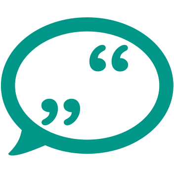

# Corpus "Rᴇᴅᴇᴡɪᴇᴅᴇʀɢᴀʙᴇ" 

 

A historical German-language corpus (1840-1920) of fictional and non-fictional texts, annotated for speech, thought and writing representation 

The corpus was created by the DFG-funded project "Redewiedergabe - eine literatur- und sprachwissenschaftliche Korpusanalyse" (Leibniz Institute for the German Language / University of Würzburg). 

Homepage: www.redewiedergabe.de

* [Main corpus](data/main) **Note:** The main corpus is on its pre-release; please use [Github's Issues tracker](https://github.com/redewiedergabe/corpus/issues) if you encounter problems
* [Beta release](data/beta-release), also archived on Zenodo  
  * [Differences between the beta and final release](resources/docs/differences-main-beta.md)
* Additional material: *will be added in the future*

If you encounter any issues or have any questions, please use [Github's Issues tracker](https://github.com/redewiedergabe/corpus/issues).

# Project
The "Redewiedergabe" corpus is created by the DFG-funded project "Redewiedergabe. Eine literatur- und sprachwissenschaftliche Korpusanalyse" in a cooperation between [Leibniz-Institut für Deutsche Sprache, Mannheim](http://www1.ids-mannheim.de/lexik/home.html) ([Abteilung Lexik](http://www1.ids-mannheim.de/lexik/home.html)) and [Universität Würzburg](https://www.uni-wuerzburg.de) ([Lehrstuhl für Computerphilologie und Neuere Deutsche Literaturgeschichte](https://www.germanistik.uni-wuerzburg.de/no_cache/lehrstuehle/computerphilologie)). 

Project members: [Annelen Brunner](http://www1.ids-mannheim.de/lexik/personal/brunner.html) (IDS Mannheim), [Stefan Engelberg](http://www1.ids-mannheim.de/lexik/personal/engelberg.html) (IDS Mannheim), [Fotis Jannidis](http://www.jannidis.de/person.html) (Universität Würzburg), [Ngoc Duyen Tanja Tu](https://perso.ids-mannheim.de/seiten/tu.html) (IDS Mannheim), [Lukas Weimer](https://www.germanistik.uni-wuerzburg.de/lehrstuehle/computerphilologie/mitarbeiter/weimer/) (Universität Würzburg).

In addition, the following people participated in the annotation: Sarah Gorke, Anna Hartmann, Janne Lorenzen, Christoph Peterek, Laura Schäfer, Lisa Sergel and Theresa Valta.

Project homepage: [www.redewiedergabe.de](http://www.redewiedergabe.de)

# License

 The "Redewiedergabe" corpus is available under a <a rel="license" href="http://creativecommons.org/licenses/by-nc-sa/4.0/">Creative Commons Attribution-NonCommercial-ShareAlike 4.0 International License</a>.

We ask you to mention [project "Redewiedergabe"](http://www.redewiedergabe.de) regarding the annotation, and [project TextGrid](https://textgrid.de/digitale-bibliothek), [Deutsches Textarchiv](http://www.deutschestextarchiv.de), [Leibniz-Institut für Deutsche Sprache](http://www1.ids-mannheim.de) and [Universitätsbibliothek Bremen](http://brema.suub.uni-bremen.de) regarding the texts.

# Text sources
The "Redewiedergabe" corpus is a historical corpus of fictional and non-fictional texts. These texts were published between 1840-1920 and were compiled from the following three sources: 
* Narrative texts from the 'Digitalen Bibliothek', converted to TEI format by [project TextGrid](https://textgrid.de/digitale-bibliothek)
* Texts from the magazine "Die Grenzboten", digitized by [Universitätsbibliothek Bremen](http://brema.suub.uni-bremen.de/grenzboten) (Source: Die Grenzboten: Zeitschrift für Politik, Literatur und Kunst. Berlin: Dt. Verl, 1841-1922. Staats- und Universitätsbibliothek Bremen, Ac 7155 Public Domain Mark 1.0), TEI structuring by [Deutsches Textarchiv](http://www.deutschestextarchiv.de/doku/textquellen#grenzboten) and OCR correction by project "Redewiedergabe".
* Texts from the "Mannheimer Korpus Historischer Zeitungen und Zeitschriften" (Mannheim corpus of historical newspapers and magazines), collected by the [Leibniz-Institute für Deutsche Sprache](https://repos.ids-mannheim.de/mkhz-beschreibung.html) and converted by [Deutsches Textarchiv](http://www.deutschestextarchiv.de/doku/textquellen#mkhz).

The corpus does not consist of complete texts but of text samples. The sample length is at least 500 tokens for texts from the Digitale Bibliothek and at least 200 tokens for newspaper/magazine texts. The samples are drawn randomly from the available material with following additional rules: For the texts from the Digitale Bibliothek, it was enforced that material by each author was considered evenly within a decade. Accordingly, for the texts from MKHZ it was enforced that the different newspapers/magazines were considered evenly. Thus we prevented authors or newspapers with little material from dropping out entirely during the sampling process.
 
Each sample contains metadata with information about the publication time, text type, fictionality status and author and title if available (more information: [Metadata](resources/docs/metadata.md).  

# Annotation
The corpus contains detailed annotation of instances of speech, thought and writing representation (STWR). We distiguish four main types: direct STWR (_Er sagte: "Ich bin hungrig."_), indirect STWR (_Er sagte, er sei hungrig._), free indirect STWR (_Wo sollte er jetzt etwas zu Essen herbekommen?_) and reported STWR (_Er sprach über Restaurants._), as well as the main media speech, thought and writing. In addition to that, we annotate attributes like embedding level, non-factual STWR, borderline cases, pragmatic and metaphoric use, as well as frames, introductory expressions and speakers. 

Each corpus sample was annotated independently by two different people. The final annotation was created by a third person on the basis of those annotations. 

The detailed annotation guidelines are available at [redewiedergabe.de/richtlinien/richtlinien.html](http://redewiedergabe.de/richtlinien/richtlinien.html) (in German). 

An overview over the structure of the annotations is available at [Annotation structure](resources/docs/annotation_structure.md).

# Size
* Main corpus
  * Final release: 839 samples; 489,608 tokens; 12.123 STWR instances
  * Beta-release: 619 samples; 360,974 tokens; 9,451 STWR instances; [Detailed statistical data](resources/docs/beta_release_statistics.md)

# Format
The corpus is available in two different formats:
* [Column-based text format](resources/docs/column_based_text_format.md)
* [XML format](resources/docs/xml_format.md) 

